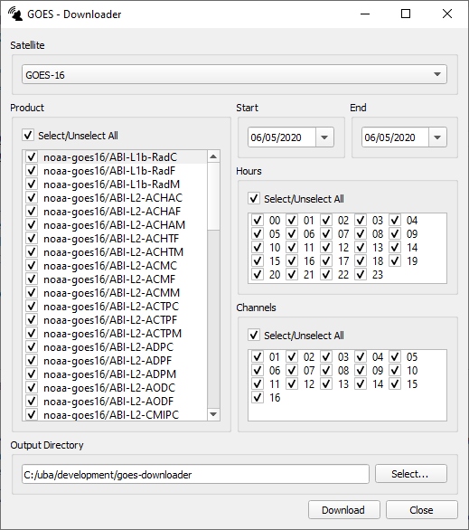
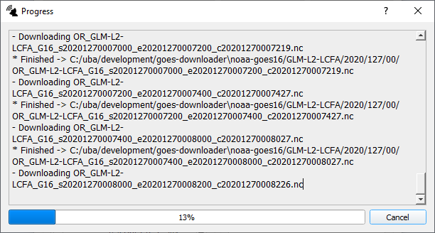

# goes-downloader
Python application that can be used to download GOES imagery on Amazon Web Service (AWS) S3 Storage.

GOES on AWS: https://registry.opendata.aws/noaa-goes/

Command-line tool and Graphical User-Interface available.

## Available Products
Some products with (C - CONUS), (M - Mesoscale) or (F - Full-disk) option.
* **ABI-L1b-Rad** - ABI L1b Radiances
* **ABI-L2-CMIP** - ABI L2 Cloud and Moisture Imagery
* **ABI-L2-MCMIP** - ABI L2 Cloud and Moisture Imagery (Multi-Band Format)
* **GLM-L2-LCFA** - GLM L2 Lightning Detection
* **ABI-L2-ACHA** - ABI L2 Cloud Top Height
* **ABI-L2-ACHT** - ABI L2 Cloud Top Temperature
* **ABI-L2-ACM** - ABI L2 Clear Sky Mask
* **ABI-L2-ACTP** - ABI L2 Cloud Top Phase
* **ABI-L2-ADP** - ABI L2 Aerosol Detection
* **ABI-L2-AOD** - ABI L2 Aerosol Optical Depth
* **ABI-L2-COD** - ABI L2 Cloud Optical Depth
* **ABI-L2-CPS** - ABI L2 Cloud Particle Size
* **ABI-L2-CTP** - ABI L2 Cloud Top Pressure
* **ABI-L2-DMW** - ABI L2 Derived Motion Winds
* **ABI-L2-DSI** - ABI L2 Derived Stability Indices
* **ABI-L2-DSR** - ABI L2 Downward Shortwave Radiation
* **ABI-L2-FDC** - ABI L2 Fire (Hot Spot Characterization)</option>
* **ABI-L2-LST** - ABI L2 Land Surface Temperature
* **ABI-L2-LVMP** - ABI L2 Legacy Vertical Moisture Profile
* **ABI-L2-LVTP** - ABI L2 Legacy Vertical Temperature Profile
* **ABI-L2-RRQPE** - ABI L2 Rainfall Rate (Quantitative Precipitation Estimate)</option>
* **ABI-L2-RSR** - ABI L2 Reflected Shortwave Radiation TOA
* **ABI-L2-SST** - ABI L2 Seas Surface Temperature
* **ABI-L2-TPW** - ABI L2 Total Precipitable Water
* **ABI-L2-VAA** - ABI L2 Volcanic Ash: Detection and Hight
* **SUVI-L1b-Fe093** - Solar Ultraviolet Imager L1b Extreme Ultraviolet Fe093
* **SUVI-L1b-Fe131** - Solar Ultraviolet Imager L1b Extreme Ultraviolet Fe131
* **SUVI-L1b-Fe171** - Solar Ultraviolet Imager L1b Extreme Ultraviolet Fe171
* **SUVI-L1b-Fe195** - Solar Ultraviolet Imager L1b Extreme Ultraviolet Fe195
* **SUVI-L1b-Fe284** - Solar Ultraviolet Imager L1b Extreme Ultraviolet Fe284
* **SUVI-L1b-He303** - Solar Ultraviolet Imager L1b ExtremeUltraviolet He303
## Usage
```
goes-downloader.py [-h] -satellite {GOES-16,GOES-17}
                        -products PRODUCTS [PRODUCTS ...]
                        -start YYYYMMDD [-end YYYYMMDD]
                        [-hours HOURS [HOURS ...]]
                        [-channels CHANNELS [CHANNELS ...]]
                        -output OUTPUT
                        [-version]

A tool to download GOES data from AWS.

optional arguments:
  -h, --help            show this help message and exit
  -satellite {GOES-16,GOES-17}, -sat {GOES-16,GOES-17}
  -products PRODUCTS [PRODUCTS ...], -p PRODUCTS [PRODUCTS ...] List of products
  -start START, -s START Start date
  -end END, -e END       End date
  -hours HOURS [HOURS ...], -hrs HOURS [HOURS ...] List of hours
  -channels CHANNELS [CHANNELS ...], -ch CHANNELS [CHANNELS ...] List of channels
  -output OUTPUT, -o OUTPUT Path to output directory that will be used to save files
  -version, -v show program's version number and exit
```

## Examples
Download GOES-16 ABI-L1b data (Full-disk), 8 April 2020, 13h, Channels: 01 (VIS), 08 (WV) and 13 (IR).
```bash
goes-downloader.py -satellite GOES-16
                   -products ABI-L1b-RadF
                   -start 20200408 -hours 13
                   -channels 01 08 13
                   -output ./my_output_dir
                   
Download GOES data:   6%|█████     | 1/18 [02:35<43:59, 155.29s/file]
```

Download GOES-16 GLM data, between 8 April 2020 and 10 April 2020, All-hours.
```bash
goes-downloader.py -satellite GOES-16
                   -products GLM-L2-LCFA
                   -start 20200408 -end 20200410
                   -output ./my_output_dir
                   
Download GOES data:   1%|▍   | 68/12960 [00:57<3:01:12,  1.19file/s]
```

## Graphical User-Interface

 
